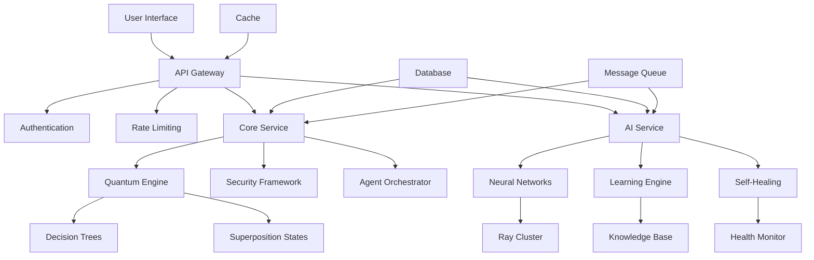
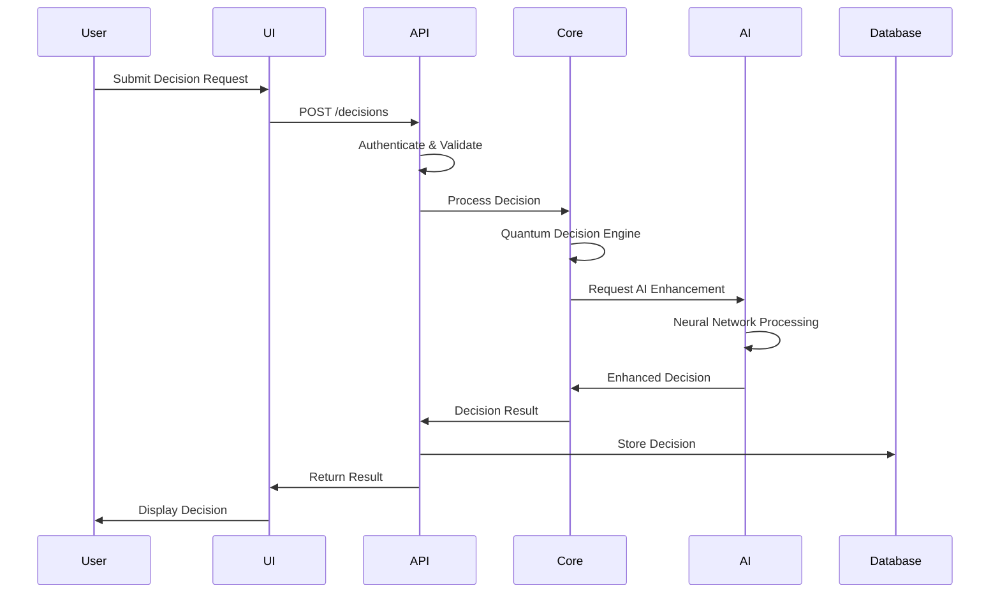
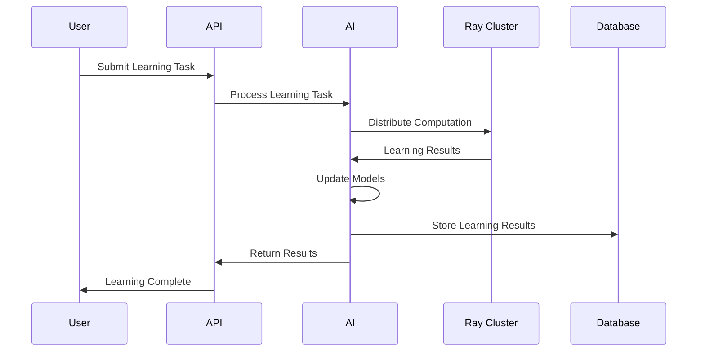
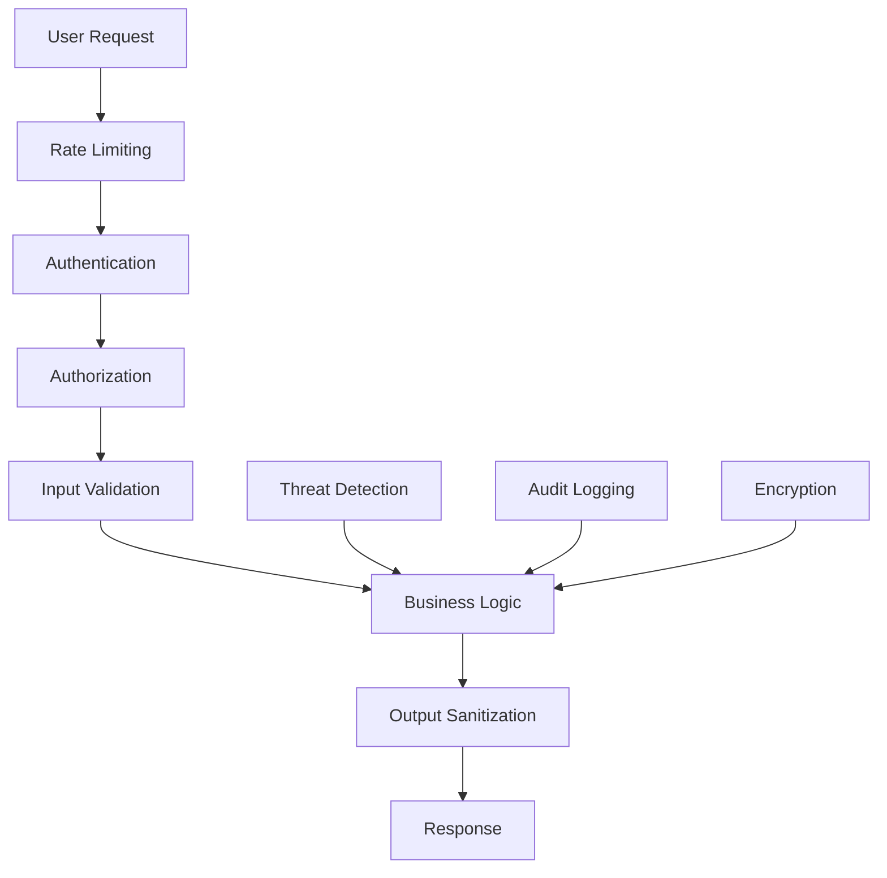

# Nexus AI Agent Framework - Architecture Documentation

## Overview

The Nexus AI Agent Framework is a next-generation AI system that combines quantum-inspired decision making, distributed neural networks, and symbiotic human-AI collaboration. This document provides a comprehensive overview of the system architecture, design principles, and component interactions.

## 🏗️ System Architecture

### High-Level Architecture

```
┌─────────────────────────────────────────────────────────────────┐
│                    Nexus AI Agent Framework                     │
├─────────────────────────────────────────────────────────────────┤
│                                                                 │
│  ┌─────────────┐    ┌─────────────┐    ┌─────────────┐        │
│  │    Core     │    │     AI      │    │     API     │        │
│  │   (Rust)    │◄──►│  (Python)   │◄──►│  (FastAPI)  │        │
│  │             │    │             │    │             │        │
│  │ • Quantum   │    │ • Neural    │    │ • RESTful   │        │
│  │   Engine    │    │   Networks  │    │   API       │        │
│  │ • Security  │    │ • Learning  │    │ • Auth      │        │
│  │ • Agents    │    │ • Self-     │    │ • Rate      │        │
│  │             │    │   Healing   │    │   Limiting  │        │
│  └─────────────┘    └─────────────┘    └─────────────┘        │
│         │                   │                   │              │
│         ▼                   ▼                   ▼              │
│  ┌─────────────┐    ┌─────────────┐    ┌─────────────┐        │
│  │     UI      │    │ Monitoring  │    │   Storage   │        │
│  │  (React)    │    │   Stack     │    │             │        │
│  │             │    │             │    │ • PostgreSQL│        │
│  │ • Dashboard │    │ • Prometheus│    │ • Redis     │        │
│  │ • Decision  │    │ • Grafana   │    │ • Ray       │        │
│  │   Maker     │    │ • ELK Stack │    │ • RabbitMQ  │        │
│  │ • Learning  │    │             │    │             │        │
│  │   Center    │    └─────────────┘    └─────────────┘        │
│  └─────────────┘                                             │
└─────────────────────────────────────────────────────────────────┘
```

### Component Interactions



## 🧠 Core Component (Rust)

### Quantum Decision Engine

The quantum decision engine implements quantum-inspired algorithms for decision making:

```rust
pub struct QuantumDecisionEngine {
    superposition_states: Vec<SuperpositionState>,
    entanglement_matrix: Matrix<f64>,
    uncertainty_quantifier: UncertaintyQuantifier,
    decision_tree: QuantumDecisionTree,
}
```

**Key Features:**
- **Superposition States**: Multiple decision outcomes simultaneously
- **Entanglement Effects**: Interdependent decision relationships
- **Uncertainty Quantification**: Confidence scoring with uncertainty bounds
- **Quantum Decision Trees**: Hierarchical decision structures

### Security Framework

```rust
pub struct QuantumSecurityFramework {
    quantum_cryptography: QuantumCryptography,
    adaptive_threat_detection: AdaptiveThreatDetection,
    dynamic_security_posture: DynamicSecurityPosture,
    distributed_security: DistributedSecurityArchitecture,
}
```

**Security Features:**
- **Post-Quantum Cryptography**: Lattice-based, hash-based, multivariate
- **Adaptive Threat Detection**: ML-based anomaly detection
- **Dynamic Security Posture**: Context-aware security levels
- **Distributed Authentication**: Multi-factor with quantum-resistant protocols

### Agent Orchestration

```rust
pub struct AgentOrchestrator {
    agent_registry: HashMap<String, AgentCapabilities>,
    task_distributor: TaskDistributor,
    conflict_resolver: ConflictResolver,
    performance_monitor: PerformanceMonitor,
}
```

**Orchestration Features:**
- **Dynamic Task Distribution**: Intelligent workload balancing
- **Conflict Resolution**: Game theory-based mechanisms
- **Performance Monitoring**: Real-time tracking and optimization
- **Resource Management**: Efficient allocation and scaling

## 🤖 AI Module (Python)

### Distributed Neural Networks

```python
class DistributedNeuralNetwork:
    def __init__(self, config):
        self.layers: Dict[str, NetworkLayer] = {}
        self.distributed_nodes: Dict[str, Any] = {}
        self.device = torch.device(config.device)
```

**Network Architecture:**
- **Input Layer**: Data preprocessing and feature extraction
- **Hidden Layers**: Distributed processing with attention mechanisms
- **Memory Layer**: Long-term memory and context preservation
- **Output Layer**: Decision generation and response synthesis

### Adaptive Learning System

```python
class AdaptiveLearningOrchestrator:
    def __init__(self, config):
        self.supervised_learner = SupervisedLearner(config)
        self.unsupervised_learner = UnsupervisedLearner(config)
        self.reinforcement_learner = ReinforcementLearner(config)
        self.meta_learner = MetaLearner(config)
        self.few_shot_learner = FewShotLearner(config)
```

**Learning Modalities:**
- **Supervised Learning**: Labeled data training
- **Unsupervised Learning**: Pattern discovery and clustering
- **Reinforcement Learning**: Reward-based optimization
- **Meta Learning**: Learning to learn
- **Few-Shot Learning**: Rapid adaptation with minimal data

### Self-Healing Architecture

```python
class SelfHealingArchitecture:
    def __init__(self, config):
        self.health_monitor = HealthMonitor()
        self.failure_predictor = FailurePredictor()
        self.repair_engine = RepairEngine()
        self.optimization_engine = OptimizationEngine()
```

**Self-Healing Features:**
- **Health Monitoring**: Continuous system health assessment
- **Failure Prediction**: ML-based failure prediction
- **Automatic Repair**: Self-repairing mechanisms
- **Performance Optimization**: Continuous optimization

## 🔄 API Layer (FastAPI)

### RESTful API Design

```python
class NexusAPI:
    def __init__(self):
        self.app = FastAPI(
            title="Nexus AI Agent Framework API",
            description="RESTful API for next-generation AI agent interactions",
            version="0.1.0"
        )
```

**API Endpoints:**
- **Decisions**: `/decisions` - Quantum-inspired decision making
- **Learning**: `/learning/tasks` - Multi-modal learning tasks
- **Collaboration**: `/collaborative/*` - Human-AI collaboration
- **Monitoring**: `/monitoring/*` - System metrics and health

### Authentication & Security

```python
class AuthService:
    def __init__(self):
        self.jwt_secret = os.getenv("JWT_SECRET")
        self.token_expiry = 3600  # 1 hour
```

**Security Features:**
- **JWT Authentication**: Secure token-based authentication
- **Rate Limiting**: Request throttling and abuse prevention
- **CORS Protection**: Cross-origin resource sharing control
- **Input Validation**: Comprehensive request validation

## 🎨 User Interface (React)

### Component Architecture

```typescript
// Main App Structure
const App: React.FC = () => {
  return (
    <ErrorBoundary FallbackComponent={ErrorFallback}>
      <HelmetProvider>
        <QueryClientProvider client={queryClient}>
          <Router>
            <Routes>
              <Route path="/dashboard" element={<Dashboard />} />
              <Route path="/decisions" element={<DecisionMaker />} />
              <Route path="/learning" element={<LearningCenter />} />
              <Route path="/collaborative" element={<CollaborativeWorkspace />} />
            </Routes>
          </Router>
        </QueryClientProvider>
      </HelmetProvider>
    </ErrorBoundary>
  );
};
```

**UI Components:**
- **Dashboard**: System overview and metrics
- **Decision Maker**: Interactive decision interface
- **Learning Center**: AI training and monitoring
- **Collaborative Workspace**: Human-AI collaboration tools
- **System Monitor**: Real-time monitoring and analytics

## 🗄️ Data Architecture

### Database Schema

```sql
-- Users and Authentication
CREATE TABLE users (
    id UUID PRIMARY KEY,
    username VARCHAR(255) UNIQUE NOT NULL,
    email VARCHAR(255) UNIQUE NOT NULL,
    password_hash VARCHAR(255) NOT NULL,
    created_at TIMESTAMP DEFAULT NOW(),
    updated_at TIMESTAMP DEFAULT NOW()
);

-- Decisions and Results
CREATE TABLE decisions (
    id UUID PRIMARY KEY,
    user_id UUID REFERENCES users(id),
    input_data JSONB NOT NULL,
    decision_result JSONB NOT NULL,
    confidence FLOAT NOT NULL,
    uncertainty FLOAT NOT NULL,
    processing_time FLOAT NOT NULL,
    created_at TIMESTAMP DEFAULT NOW()
);

-- Learning Tasks
CREATE TABLE learning_tasks (
    id UUID PRIMARY KEY,
    task_type VARCHAR(50) NOT NULL,
    input_data JSONB NOT NULL,
    target_data JSONB,
    result JSONB,
    accuracy FLOAT,
    loss FLOAT,
    status VARCHAR(20) DEFAULT 'pending',
    created_at TIMESTAMP DEFAULT NOW(),
    completed_at TIMESTAMP
);

-- Collaborative Sessions
CREATE TABLE collaborative_sessions (
    id UUID PRIMARY KEY,
    user_id UUID REFERENCES users(id),
    problem_description TEXT NOT NULL,
    status VARCHAR(20) DEFAULT 'active',
    session_start TIMESTAMP DEFAULT NOW(),
    session_end TIMESTAMP,
    collaboration_score FLOAT
);
```

### Caching Strategy

```python
# Redis Cache Configuration
CACHE_CONFIG = {
    "decision_cache": {
        "ttl": 3600,  # 1 hour
        "max_size": 10000
    },
    "user_session_cache": {
        "ttl": 1800,  # 30 minutes
        "max_size": 1000
    },
    "model_cache": {
        "ttl": 86400,  # 24 hours
        "max_size": 100
    }
}
```

## 🔧 Infrastructure Architecture

### Container Orchestration

```yaml
# Docker Compose Services
services:
  nexus-core:
    build: ./core
    ports: ["8080:8080"]
    environment:
      - QUANTUM_ENGINE_ENABLED=true
      - COGNITIVE_NETWORK_NODES=4
    volumes:
      - ./core/config:/app/config
      - nexus-core-data:/app/data

  nexus-ai:
    build: ./ai
    ports: ["8081:8081"]
    environment:
      - RAY_ADDRESS=nexus-ray:6379
      - CUDA_VISIBLE_DEVICES=0
    volumes:
      - ./ai/models:/app/models
      - nexus-ai-data:/app/workspace
```

### Monitoring Stack

```yaml
# Prometheus Configuration
global:
  scrape_interval: 15s
  evaluation_interval: 15s

scrape_configs:
  - job_name: 'nexus-core'
    static_configs:
      - targets: ['nexus-core:8080']
  
  - job_name: 'nexus-ai'
    static_configs:
      - targets: ['nexus-ai:8081']
  
  - job_name: 'nexus-api'
    static_configs:
      - targets: ['nexus-api:8000']
```

## 🔄 Data Flow

### Decision Making Flow



### Learning Flow



## 🔒 Security Architecture

### Security Layers



### Quantum-Resistant Security

```rust
pub struct QuantumSecurityFramework {
    // Lattice-based cryptography
    lattice_crypto: LatticeBasedCrypto,
    
    // Hash-based signatures
    hash_signatures: HashBasedSignatures,
    
    // Multivariate cryptography
    multivariate_crypto: MultivariateCrypto,
    
    // Quantum key distribution
    qkd: QuantumKeyDistribution,
}
```

## 📊 Performance Architecture

### Scalability Design

```yaml
# Horizontal Scaling Configuration
scaling:
  core_services:
    min_replicas: 2
    max_replicas: 10
    target_cpu_utilization: 70%
  
  ai_services:
    min_replicas: 3
    max_replicas: 20
    target_memory_utilization: 80%
  
  api_services:
    min_replicas: 2
    max_replicas: 15
    target_cpu_utilization: 75%
```

### Performance Metrics

```python
# Key Performance Indicators
KPIS = {
    "decision_latency": {
        "target": "< 1ms",
        "measurement": "p95_response_time"
    },
    "throughput": {
        "target": "> 10,000 req/s",
        "measurement": "requests_per_second"
    },
    "accuracy": {
        "target": "> 95%",
        "measurement": "decision_accuracy"
    },
    "availability": {
        "target": "> 99.9%",
        "measurement": "uptime_percentage"
    }
}
```

## 🔮 Future Architecture

### Planned Enhancements

1. **Quantum Computing Integration**
   - Direct quantum computer integration
   - Quantum advantage algorithms
   - Hybrid quantum-classical systems

2. **Edge Computing Support**
   - Distributed edge nodes
   - Local decision making
   - Edge-to-cloud synchronization

3. **Advanced AI Capabilities**
   - AGI-level reasoning
   - Multi-modal understanding
   - Creative problem solving

4. **Global Deployment**
   - Multi-region deployment
   - Global load balancing
   - Cross-region data synchronization

## 📚 Additional Resources

- [API Documentation](./api-reference.md)
- [Deployment Guide](./deployment.md)
- [Security Guide](./security.md)
- [Performance Tuning](./performance.md)
- [Troubleshooting](./troubleshooting.md) 